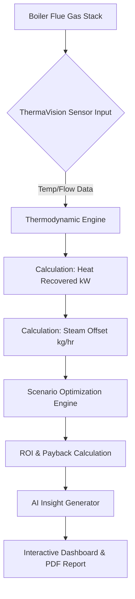
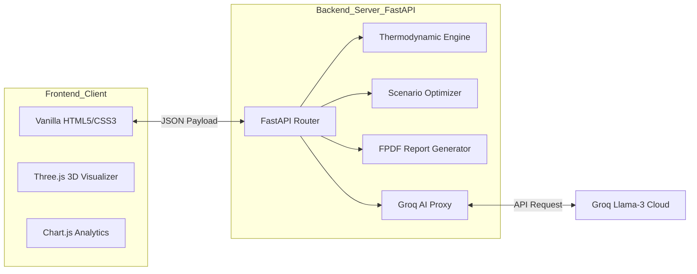

# 📄 ThermaVision — Hackathon Submission Details

This document provides a comprehensive breakdown of the **ThermaVision** project for the **SugarNxt Hackathon 2026**.

---

## 💡 (A) Brief About the Idea

**ThermaVision** is an AI-powered industrial intelligence portal designed to help sugar mills capture and repurpose waste heat from boiler flue gases. 
- 🚀 **Core Concept**: Boiler flue gases are often emitted at high temperatures (180°C–400°C), wasting significant thermal energy.
- ♻️ **Process**: We divert this gas through a specialized Heat Recovery Unit (HRU) to pre-heat "Raw Juice" or "Mixed Juice" before evaporation.
- 🎯 **Goal**: To reduce the high-pressure steam requirement from the boiler, directly lowering **Bagasse** fuel consumption and improving the thermal efficiency of the entire plant.

---

## 📈 (B) Opportunity Analysis

### 🔄 (i) Differentiation from Existing Ideas
- 📊 **Beyond Basic Monitoring**: Unlike standard SCADA systems that only log data, ThermaVision uses a built-in thermodynamic simulation engine to project real-time ROI and climate impact.
- 🧠 **Physics-First AI**: Integrates industrial physics ($Q = ṁ \times C_p \times \Delta T$) with a custom LLM (Groq Llama-3) to provide boardroom-ready engineering insights rather than just raw numbers.
- 🛡️ **Predictive Safeguards**: Features an "Acid Dew Point" warning system to prevent equipment corrosion—a common failure point in manual heat recovery attempts.

### 🛠️ (ii) Problem Solving Strategy
ThermaVision solves the "Invisible Waste" problem in sugar mills:
1. 📏 **Quantification**: It translates chaotic flue gas flow into tangible "Steam Saved (kg/hr)".
2. 💰 **Economic Validation**: provides side-by-side scenario comparisons (Base vs. Optimized) to convince stakeholders of CAPEX value.
3. 🗺️ **Optimized Strategy**: Recommends specific heat exchanger types Based on input temperatures and flow rates.

### 🌟 (iii) Unique Selling Proposition (USP)
> **"Turning Thermal Waste into Thermodynamic Wealth with Zero-Touch Intelligence."**
ThermaVision’s USP is its combination of **Engineering-Grade Precision** and **Executive-Level Insights**, enabling process managers to make multi-million dollar energy decisions in seconds.

---

## ✨ (C) List of Features
- 🎨 **3D Thermodynamic Visualizer**: Built with Three.js to show energy flow.
- 🎚️ **Interactive ROI Simulator**: Live sliders for fuel costs and operating hours to see sensitivity results.
- 🤖 **AI Engineering Consultant (ThermaBot)**: Integration with Groq API for real-time technical support.
- 🔄 **The Energy Capture Cycle**: Multi-step visualization of heat recovery workflow.
- 📐 **Engineering Edge Kernel**: Deep-dive thermodynamic formula transparency ($Q=mCpΔT$).
- 📥 **Automated Technical Reports**: Professional PDF generation for offline review.
- 🌍 **Climate Impact Forecast**: Translates saved CO₂ into intuitive metrics (Trees planted/Cars removed).
- ⚖️ **Multi-Scenario Comparison**: Analyzes "Base", "Improved", and "Optimized" hardware setups.

---

## 🔄 (D) Process Flow Diagram

---

## 🖼️ (E) Wireframes & Mock Diagrams

**1. 🏠 Landing Page (The Hook)**:
- Hero section with 3D particles representing heat flow.
- Quick-stats strip showing aggregate potential savings across the industry.

**2. 🧪 Simulation Interface (The Input)**:
- Glassmorphism form cards.
- Real-time field validation with tooltips explaining thermodynamic variables.

**3. 📊 Analysis Dashboard (The Payload)**:
- High-contrast metric cards with animated numbers.
- Dual-axis Chart.js visualizations for ROI projections.
- Fixed floating 'ThermaBot' for conversational assistance.

---

## 🏗️ (F) Architecture Diagram

---

## 🛠️ (G) Technologies Used
- 🐍 **Backend**: Python (FastAPI, Uvicorn, Pydantic, FPDF2).
- 🌐 **Frontend**: HTML5, CSS3 (Vanilla), JavaScript (ES6+).
- 💠 **Visuals**: Three.js (3D Particles), Chart.js (Data Rendering), Lucide (Iconography).
- 🧠 **AI Engine**: Groq Cloud API (Llama-3.3-70b-versatile).
- 🔐 **Environment**: Python-Dotenv for secured API key management.

---

## 💸 (H) Estimated Implementation Cost

| Phase | Milestone | Est. Cost (USD) | 
| :--- | :--- | :--- |
| **I** | 💻 Simulation Software & AI Integration | $25,000 |
| **II** | 📡 IoT Sensor Deployment (Per Mill) | $15,000 |
| **III** | 🏗️ Heat Exchanger Hardware (Typical) | $150,000 |
| **IV** | 👨‍🏫 Commissioning & Training | $10,000 |
| **TOTAL** | **💰 Full Scale Implementation** | **~$200,000** |
*(Note: Payback period typically achieved in < 24 months through fuel savings.)*

---

## ✅ (I) Hackathon Compliance Checklist
- 📦 **Submission Type**: Zero-Touch Manufacturing / Energy Optimization.
- 🏢 **Industry Category**: Sugar Industry (PS-5 Solution).
- 🧑‍💻 **Team**: Babin Bid (Lead), Debasmita Bose, Joita Paul, Manisha Debnath.
- 🚀 **Scalability**: Designed for easy integration into existing SCADA frameworks.

---
*Created for the SugarNxt Hackathon 2026.*
